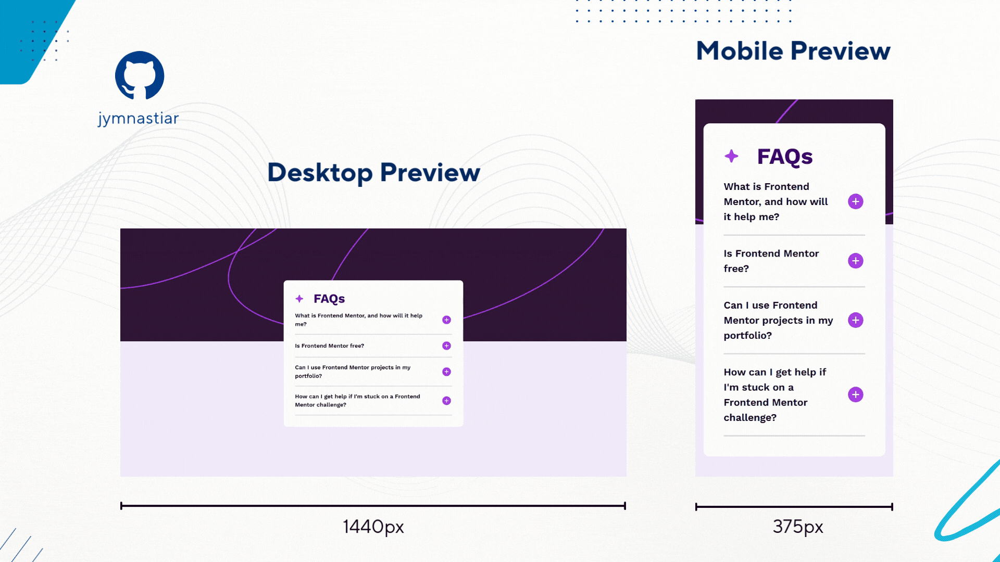

# Frontend Mentor - FAQ accordion solution

This is a solution to the [FAQ accordion challenge on Frontend Mentor](https://www.frontendmentor.io/challenges/faq-accordion-wyfFdeBwBz). Frontend Mentor challenges help you improve your coding skills by building realistic projects. 

## Table of contents

- [Overview](#overview)
  - [The challenge](#the-challenge)
  - [Screenshot](#screenshot)
  - [Links](#links)
- [My process](#my-process)
  - [Built with](#built-with)
  - [What I learned](#what-i-learned)
  - [Continued development](#continued-development)
  - [Useful resources](#useful-resources)
- [Author](#author)

## Overview

### The challenge

Users should be able to:

- Hide/Show the answer to a question when the question is clicked
- Navigate the questions and hide/show answers using keyboard navigation alone
- View the optimal layout for the interface depending on their device's screen size
- See hover and focus states for all interactive elements on the page

### Screenshot

### Links

- [Solution URL](https://github.com/jymnastiar/simple-FAQ)
- [Live Site URL](https://simple-faq-jym.vercel.app/)

## My process

### Built with

- Semantic HTML5 markup
- CSS custom properties
- Flexbox
- CSS Grid
- Mobile-first workflow
- [Tailwind CSS](https://tailwindcss.com/) - Utility-first CSS framework
- Vanilla JavaScript

### What I learned

Simple think about JavaScript DOM manipulation

### Continued development

IA practice project to strengthen my DOM manipulation skills in vanilla JavaScript.

### Useful resources

- [BroCode](https://www.youtube.com/@brocodez) This channel helps a lot in mastering JS.
- [Tailwind CSS](https://tailwindcss.com/) This documentation was instrumental in helping me understand how to build layouts using utility classes.

## Author

- Frontend Mentor - [@jymnastiar](https://www.frontendmentor.io/profile/jymnastiar)
- Linkedin - [@jymnastiar](https://www.linkedin.com/in/jymnastiar/)